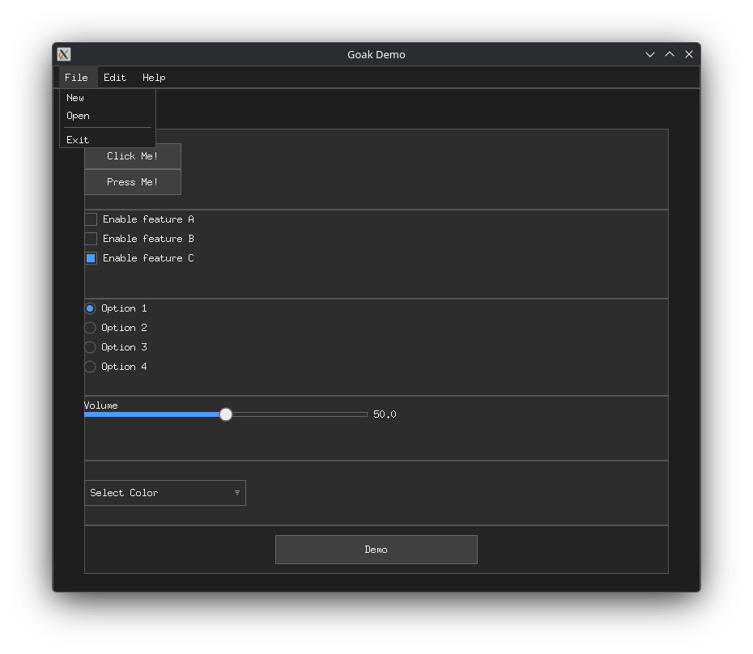

# goak

Go Application Kit is a small library for building cross-platform UI apps.
It uses Ebiten for windowing/input/rendering and focuses on rapid prototyping.


Features:
- Layout management inspired by Clay.h
- Handy utilities like named colors (Example, `colors.LightGray`)
- GPU Accelerated



## Run examples

```bash
go run .examples/<example>/main.go
```

Check `examples/demo/main.go` for a widget/features showcase

**Build:** `go build -o bin/basic ./examples/basic` (on Windows add `-ldflags="-H windowsgui"`).

## Using the library

```go
import (
	"goak/internal/goak"
	"goak/internal/goak/components"
	"goak/internal/goak/layout"
)
```
