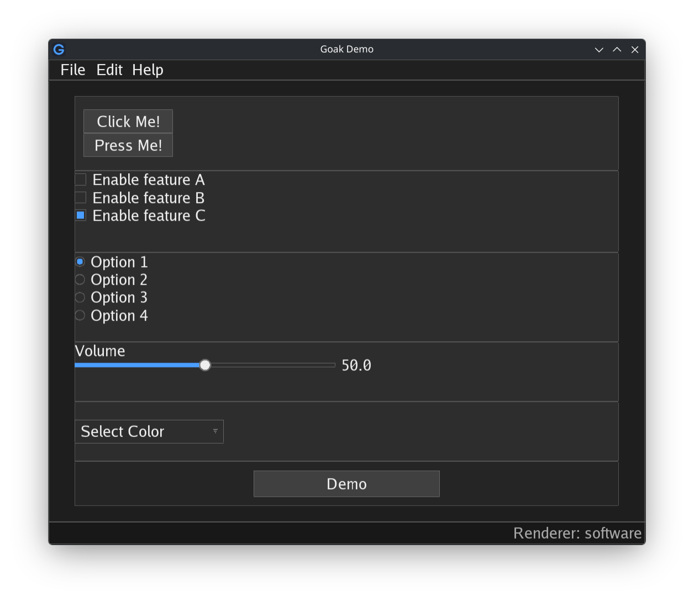

# goak

Go Application Kit is a small library for building cross-platform UI apps.
It uses SDL3 for windowing, input, and GPU-accelerated rendering, with SDL_ttf
for text, and focuses on rapid prototyping.


Features:
- Layout management inspired by Clay.h
- Handy utilities like named colors (Example, `colors.LightGray`)
- Themes through a central unified structured (External configuration may come soon)
- SDL3 rendering with resizable and HiDPI-aware windows
- Selectable SDL renderers, with software rendering as the default
- Embedded SDL3, SDL_ttf, and default font assets
- Native window icons from any standard Go `image.Image`



## Run examples

```bash
go run ./examples/<example>
```

Check `examples/demo/main.go` for a widget/features showcase. The basic example
also generates and installs a window icon entirely in Go code.

**Build:** `go build -o bin/basic ./examples/basic`. On Windows, optionally add
`-ldflags="-H windowsgui"` to build a GUI executable without an accompanying
console window; omit it during development to retain console logs and panic output.

## Using the library

```go
import (
	"goak/internal/goak"
	"goak/internal/goak/components"
	"goak/internal/goak/layout"
)
```
